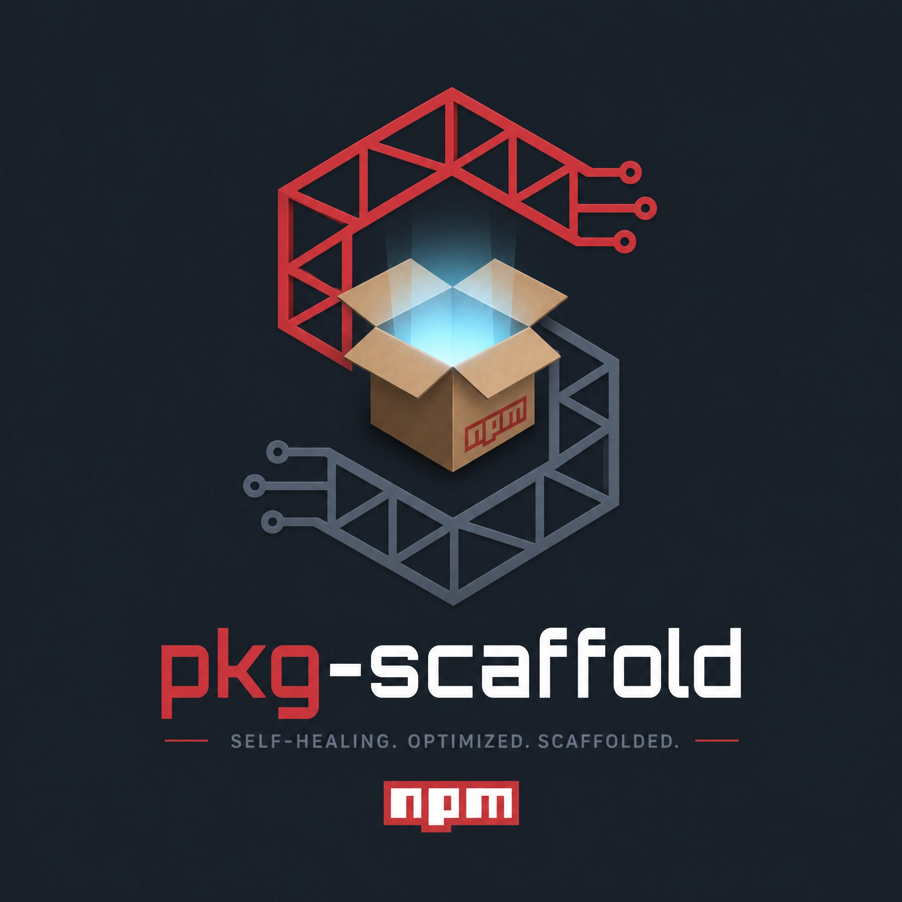

# README



**The Ultimate Enterprise Codebase Janitor: OXC-Powered, Type-Aware, and Self-Healing.**

   

`pkg-scaffold` is the industry's most advanced codebase optimization engine. Version 3.1.3 marks a massive leap forward, outperforming Knip v6 with a hybrid **OXC + TypeScript** architecture. It doesn't just find dead code—it safely prunes it and validates your project's integrity through a unique **Self-Healing Loop**.

## Features

- **Extreme Speed with OXC**: By integrating the Rust-based OXC parser, `pkg-scaffold` achieves a 2-4x performance boost.
- **True Type-Aware Analysis**: Uses the full TypeScript Compiler API to resolve types across your entire project.
- **Automated Self-Healing**: Identifies unused code, removes it, and validates the change through tests.
- **Modular Plugin Ecosystem**: Supports local configurations and custom plugins, including Knip compatibility.

## Getting Started

### Installation

```bash
npm install -g pkg-scaffold
```

### Usage

```bash
pkg-scaffold init my-project
pkg-scaffold --fix --test-command 'npm test'
```

## Documentation

- [home](https://dreamlongyt.github.io/pkg-scaffold/)
- [guide](https://dreamlongyt.github.io/pkg-scaffold/guide)
- [references](https://dreamlongyt.github.io/pkg-scaffold/reference)

## License

MIT © DreamLongYT & The Enhanced Contributors.
